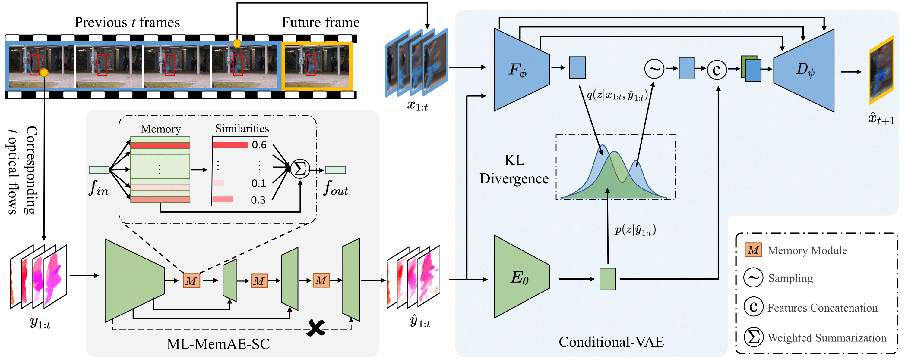

## HF2-VAD
Offcial implementation of "A Hybrid Video Anomaly Detection Framework via
Memory-Augmented Flow Reconstruction and Flow-Guided Frame Prediction, ICCV-2021".

[\[Paper\]](./assets/HF2_VAD_ICCV21_CR.pdf) 
[\[Supp\]](./assets/HF2_VAD_ICCV21_Supp_CR.pdf)
[\[arXiv\]](https://arxiv.org/abs/2108.06852)


## 1. Dependencies
```
python==3.6
pytorch==1.5.1
mmcv-full==1.3.1
mmdet==2.11.0
scikit-learn==0.23.2
edflow==0.4.0
PyYAML==5.4.1
tensorboardX==2.4
```
## 2. Usage
### 2.1 Data preparation
Please follow the [instructions](./pre_process/readme.md) to prepare the training and testing dataset.

### 2.2 Train
We train the ML-MemAE-SC at first, then train CVAE model with the reconstructed flows,
and finally finetune the whole framework. All the config files are located at `./cfgs`. 

To train the ML-MemAE-SC, run:
```python
$ python ml_memAE_sc_train.py
```
To train the CVAE model with reconstructed flows, run:
```python
$ python trian.py
```
And finetune the whole HF2VAD framework together as:
```python
$ python finetune.py
```
For different datasets, please modify the configuration files accordingly.

### 2.3 Evaluation
To evaluation the anomaly detection performance of the trained model, run:
```python
$ python eval.py [--model_save_path] [--cfg_file] 
```
E.g., for the ped2 dataset:
```python
$ python eval.py \
         --model_save_path=./pretrained_ckpts/ped2_HF2VAD_99.31.pth \
         --cfg_file=./pretrained_ckpts/ped2_HF2VAD_99.31_cfg.yaml
```
You can download the pretrained weights of HF2VAD for Ped2, Avenue and ShanghaiTech datasets 
from [here](https://drive.google.com/drive/folders/10B7WmZmBSgOPjkbedK9JwH6HRo06VSC2?usp=sharing).

## 3. Results

|     Model      | UCSD Ped2 | CUHK Avenue | ShanghaiTech |
| :------------: | :-------: | :---------: | :----------: |
|    HF2-VAD     |   99.3%   |    91.1%    |    76.2%     |

## Acknowledgment
We thank jhaux for the PyTorch implementation of the [conditional VAE](https://github.com/jhaux/VUNet).

## Citation
If you find this repo useful, please consider citing:
```
@inproceedings{liu2021hf2vad,
title = {A Hybrid Video Anomaly Detection Framework via Memory-Augmented Flow Reconstruction and Flow-Guided Frame Prediction},
author = {Liu, Zhian and Nie, Yongwei and Long, Chengjiang and Zhang, Qing and Li, Guiqing},
booktitle={Proceedings of the IEEE International Conference on Computer Vision},
year = {2021}
}
```
